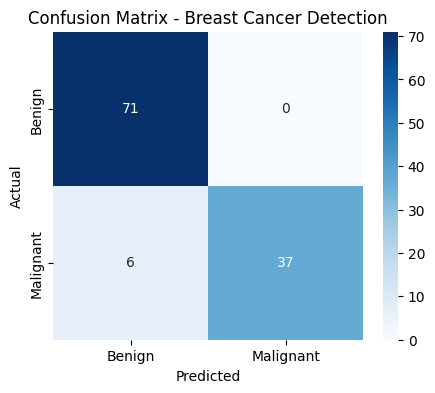

# Breast Cancer Detection using Support Vector Machine (SVM)

# Overview
This project aims to detect breast cancer as **Benign** or **Malignant** using the Breast Cancer Wisconsin dataset.  
We applied **Support Vector Machine (SVM)** for classification.

# Dataset
- File: breast-cancer.csv
- Rows: 569
- Columns: 32
- Target Variable: `diagnosis` (M = Malignant, B = Benign)
- No missing values

# Steps Performed
1. Data Loading & Inspection
   - Checked shape, data types, and missing values
2. Data Cleaning
   - Dropped `id` column (not useful for prediction)
   - Converted `diagnosis` to numerical (`M` → 1, `B` → 0)
3. Feature Selection
   - Used all remaining 30 features
4. Data Splitting
   - 80% training (455 samples)
   - 20% testing (114 samples)
5. Feature Scaling
   - Applied Min-Max Scaling
6. Model Training
   - Used **SVC(random_state=42)**
7. Model Evaluation
   - Training Accuracy: **91.42%**
   - Testing Accuracy: **94.73%**
   - Confusion Matrix & Classification Report

# Results
# Confusion Matrix
| Actual / Predicted | Benign | Malignant |
|--------------------|--------|-----------|
| **Benign**         | 71     | 0         |
| **Malignant**      | 6      | 37        |

# Classification Report
| Class      | Precision | Recall | F1-score |
|------------|-----------|--------|----------|
| Benign     | 0.92      | 1.00   | 0.96     |
| Malignant  | 1.00      | 0.86   | 0.93     |

# Visualization

# Libraries Used
- pandas
- numpy
- scikit-learn
- matplotlib
- seaborn
  
# Conclusion
The **SVM model** achieved **95% accuracy** in classifying breast cancer cases.  
It perfectly classified benign cases and had a small number of false negatives for malignant cases.
